# Real-time Multi-Model Object Classifier Report

**Dawood University of Engineering and Technology**  
**Department of Artificial Intelligence**

**Course:** Machine Learning
**Lab Activity:** Lab-14 (Complex Computing Activity)  
**Semester:** 7th Semester | Batch 2022

**Group Members:**
*   Hamza Kamelen (22F-BSAI-09)
*   Moiz Ahmed Mansoori (22F-BSAI-32)
*   Muzzamil Khalid (22F-BSAI-29)
*   Muhammad Sami (22F-BSAI-43)

**Submitted to:** Engr. Hamza Farooqui  
**Submission Date:** January 7, 2026

---

## 1. Introduction

This project implements a real-time object detection system designed to operate with a mobile phone camera as the video input source. The system leverages state-of-the-art deep learning models, specifically YOLOv8 and YOLOv5, to detect and classify objects in live video streams. The primary objective is to demonstrate a complete machine learning pipeline—from data acquisition and preprocessing to model inference and performance evaluation—within a resource-constrained environment (simulated via mobile camera input and cloud/local processing).

The system is built to allow real-time switching between models, enabling a direct comparison of performance metrics such as Frames Per Second (FPS) and inference latency. Additionally, a specialized **Gun Detector** model is integrated to demonstrate a security-focused use case. This report details the system architecture, model designs, experimental results, and the challenges encountered during development.

---

## 2. System Architecture & Pipeline

The system follows a modular pipeline architecture designed for efficiency and extensibility. The data flows from the mobile camera source through preprocessing, inference, and finally to visualization.

### 2.1 System Architecture & Pipeline

**Figure 1: High-Level System Context**

```mermaid
graph LR
    %% Style Definitions
    classDef mobile fill:#e1f5fe,stroke:#01579b,stroke-width:2px,color:#01579b;
    classDef system fill:#f3e5f5,stroke:#4a148c,stroke-width:2px,color:#4a148c;
    classDef display fill:#e8f5e9,stroke:#1b5e20,stroke-width:2px,color:#1b5e20;
    classDef stream stroke-dasharray: 5 5;

    subgraph Source [Input Source]
        Mobile[📱 Mobile Camera]:::mobile
        App[🌐 IP Webcam App]:::mobile
    end

    subgraph Core [Processing Unit]
        Engine[⚙️ Multi-Model Classifier]:::system
    end

    subgraph Output [Visualization]
        Screen[🖥️ Display Screen]:::display
    end

    Mobile -->|Optical Input| App
    App -.->|Wi-Fi Stream (HTTP/RTSP)| Engine
    Engine -->|Annotated Frames| Screen
```

**Figure 2: Detailed Processing Pipeline**

```mermaid
graph TD
    %% Style Definitions
    classDef input fill:#fff3e0,stroke:#e65100,stroke-width:2px,color:#e65100;
    classDef process fill:#e3f2fd,stroke:#1565c0,stroke-width:2px,color:#1565c0;
    classDef model fill:#fce4ec,stroke:#880e4f,stroke-width:2px,color:#880e4f;
    classDef logic fill:#f3e5f5,stroke:#4a148c,stroke-width:2px,color:#4a148c;
    classDef output fill:#e8f5e9,stroke:#2e7d32,stroke-width:2px,color:#2e7d32;

    %% Nodes
    Cam(🎥 Video Capture):::input
    
    subgraph Preprocessing [⚡ Preprocessing Layer]
        Resize(📐 Resize 640x640):::process
        Color(🎨 BGR to RGB):::process
        Norm(📊 Normalize 0-1):::process
    end

    subgraph Inference [🧠 Inference Engine]
        Switch{🔀 Model Selector}:::logic
        Y8[🚀 YOLOv8-nano]:::model
        Y5[🛡️ YOLOv5-small]:::model
        Gun[🔫 Gun Detector]:::model
    end

    subgraph PostProcessing [🔧 Post-Processing]
        NMS(🧹 NMS Filter):::process
        Conf(🎯 Confidence Thresh):::process
    end

    Viz(🖼️ Visualization):::output

    %% Connections
    Cam --> Resize
    Resize --> Color
    Color --> Norm
    Norm --> Switch
    
    Switch -->|Default| Y8
    Switch -->|Alternative| Y5
    Switch -->|Security Mode| Gun
    
    Y8 --> NMS
    Y5 --> NMS
    Gun --> NMS
    
    NMS --> Conf
    Conf --> Viz
```



**Figure 3: Runtime Execution Flow (Sequence)**

```mermaid
sequenceDiagram
    participant Cam as 📱 IP Webcam
    participant Sys as ⚙️ Main System
    participant Model as 🧠 AI Model
    participant UI as 🖥️ Display

    Note over Sys: Initialization Phase
    Sys->>Model: Load Weights (YOLOv8/v5/Gun)
    Model-->>Sys: Model Ready (CUDA/CPU)

    loop Real-time Loop (30+ FPS)
        Cam->>Sys: Send Video Frame (HTTP)
        activate Sys
        Sys->>Sys: Preprocess (Resize/Norm)
        
        Sys->>Model: Inference Request (Tensor)
        activate Model
        Model-->>Sys: Raw Detections
        deactivate Model
        
        Sys->>Sys: Post-process (NMS)
        Sys->>UI: Render Bounding Boxes
        deactivate Sys
    end
```



### 2.2 Component Description

1.  **Input Acquisition**: The system connects to an Android device running the "IP Webcam" application. Video frames are captured over Wi-Fi using OpenCV's `VideoCapture` interface.
2.  **Preprocessing**: Raw frames are resized to the model's expected input dimension (640x640 pixels). Pixel values are normalized from [0, 255] to [0, 1], and the color space is converted from BGR (OpenCV default) to RGB (Model expectation).
3.  **Inference Engine**: The core detection logic supports hot-swapping between:
    *   **YOLOv8-nano**: The latest iteration of the YOLO family, optimized for speed and accuracy.
    *   **YOLOv5-small**: A robust and widely used lightweight model.
    *   **Gun Detector**: A specialized YOLOv8 model fine-tuned for weapon detection (guns/pistols) for security applications.
4.  **Post-Processing**: Raw model outputs are filtered using Non-Maximum Suppression (NMS) to remove duplicate bounding boxes. Detections below a configurable confidence threshold (default 0.5) are discarded.
5.  **Visualization**: The system overlays bounding boxes, class names, confidence scores, and real-time performance metrics (FPS, Latency) onto the original video feed.

---

## 3. Dataset & Preprocessing

### 3.1 Dataset Description
The models used in this project are pre-trained on the **COCO (Common Objects in Context)** dataset. COCO is a large-scale object detection, segmentation, and captioning dataset widely used as a benchmark in computer vision.

*   **Classes**: 80 common object categories (e.g., person, car, dog, chair, bottle).
*   **Diversity**: The dataset contains over 200,000 labeled images with complex everyday scenes, ensuring the models are robust to varying lighting, occlusion, and object scales.

### 3.2 Preprocessing Steps
To ensure compatibility with the pre-trained models, the following preprocessing steps are applied to every incoming video frame:

1.  **Resizing**: Input frames (typically 1920x1080 or 1280x720 from the phone) are resized to **640x640** pixels. This specific resolution balances inference speed with detection accuracy. Bilinear interpolation is used to minimize aliasing artifacts.
2.  **Color Space Conversion**: OpenCV captures images in **BGR** (Blue-Green-Red) format. The models, trained on RGB images, require a conversion step: `cv2.cvtColor(frame, cv2.COLOR_BGR2RGB)`.
3.  **Normalization**: Pixel intensity values are scaled from the integer range `[0, 255]` to the floating-point range `[0.0, 1.0]`. This standardization helps the neural network converge faster and perform more consistently.
4.  **Batching**: The single processed image is expanded to add a batch dimension (Shape: `[1, 3, 640, 640]`) before being passed to the model.

---

## 4. Model Designs & Evaluation

### 4.1 Model Specifications

| Feature | YOLOv8-nano | YOLOv5-small | Gun Detector (YOLOv8) |
| :--- | :--- | :--- | :--- |
| **Architecture** | Anchor-free, Decoupled Head | Anchor-based, Coupled Head | Anchor-free, Decoupled Head |
| **Parameters** | ~3.2 Million | ~7.2 Million | ~3.2 Million |
| **Input Size** | 640x640 | 640x640 | 640x640 |
| **Framework** | Ultralytics | PyTorch Hub | Ultralytics |
| **Strengths** | Higher accuracy, better small object detection | Mature ecosystem, stable deployment | Specialized for security, high recall for weapons |

### 4.2 Hyperparameters
The following hyperparameters were configured for the inference phase:

*   **Confidence Threshold (`--conf`)**: **0.50**. Detections with a confidence score below 50% are ignored to reduce false positives.
*   **IoU Threshold (`--iou`)**: **0.45**. Intersection over Union threshold used for Non-Maximum Suppression (NMS) to merge overlapping boxes for the same object.
*   **Device**: **Auto** (CUDA GPU if available, otherwise CPU).

### 4.3 Performance Evaluation
The system measures performance in real-time. Key metrics include:

*   **Inference Time**: The time taken by the model to process a single frame (excluding preprocessing/post-processing).
*   **FPS (Frames Per Second)**: The total throughput of the system.

**Observed Results (Typical):**

| Metric | YOLOv8-nano | YOLOv5-small |
| :--- | :--- | :--- |
| **Inference Time (GPU)** | ~15-20 ms | ~25-30 ms |
| **FPS (GPU)** | ~45-55 FPS | ~35-45 FPS |
| **Inference Time (CPU)** | ~100-150 ms | ~150-200 ms |
| **FPS (CPU)** | ~5-8 FPS | ~3-5 FPS |

*Note: Performance varies based on hardware. GPU acceleration significantly improves real-time capability.*

---

## 5. Challenges, Limitations & Ethics

### 5.1 Challenges
1.  **Network Latency**: Streaming high-resolution video from a mobile phone over Wi-Fi introduces latency. Network instability can cause frame drops or lag, affecting the "real-time" feel.
2.  **Hardware Constraints**: Running deep learning models on a standard laptop CPU results in low FPS (5-10 FPS). To achieve smooth 30+ FPS, a dedicated GPU (NVIDIA CUDA) or cloud environment (Google Colab) is required.
3.  **Lighting Conditions**: The models struggle in low-light environments or with strong backlighting, leading to missed detections or misclassifications.

### 5.2 Limitations
*   **Fixed Classes**: The system is limited to the 80 classes in the COCO dataset. It cannot detect objects outside this predefined list without retraining.
*   **Distance**: Small objects at a significant distance from the camera are often missed due to the resizing step (downsampling to 640x640).

### 5.3 Fairness & Ethical Considerations
*   **Bias**: The COCO dataset, while large, may contain biases in how certain objects or people are represented. For example, person detection accuracy might vary across different demographics if the training data was not perfectly balanced.
*   **Privacy**: Using a live camera feed raises privacy concerns. The system processes video in real-time and does not store recordings by default, mitigating some risk. However, deployment in public spaces would require consent and clear signage.
*   **Weapon Detection Risks**: The Gun Detector module must be used responsibly. False positives (detecting a phone or toy as a gun) could lead to unnecessary panic or law enforcement response. Conversely, false negatives in a real security scenario could be dangerous. This system is a prototype and should not be solely relied upon for critical security without further validation.

---

## 6. Setup & Run Instructions

### 6.1 Prerequisites
*   **Hardware**: Laptop/PC with Webcam or Android Phone (for IP Webcam). NVIDIA GPU recommended.
*   **Software**: Python 3.8+, Anaconda or Miniconda (recommended).

### 6.2 Installation

1.  **Clone the Repository**
    ```bash
    git clone https://github.com/moiz-mansoori/Real-time-Multi-Model-Object-Classifier.git
    cd Real-time-Multi-Model-Object-Classifier
    ```

2.  **Create Virtual Environment**
    ```bash
    # Create environment
    python -m venv venv
    
    # Activate (Windows)
    venv\Scripts\activate
    
    # Activate (Linux/Mac)
    source venv/bin/activate
    ```

3.  **Install Dependencies**
    ```bash
    pip install -r requirements.txt
    ```

### 6.3 Running the System

**Option 1: Using Laptop Webcam**
```bash
python main.py --model yolo8 --source 0
```

**Option 2: Using Mobile Camera (IP Webcam)**
1.  Install **IP Webcam** app on Android.
2.  Start server in app and note the IP (e.g., `http://192.168.1.5:8080`).
3.  Run command:
    ```bash
    python main.py --model yolo8 --source "http://192.168.1.5:8080/video"
    ```

**Option 3: Run Gun Detector**
```bash
python main.py --model gun --source 0
```

**Option 4: Compare Models**
```bash
python main.py --model both --source 0
```

### 6.4 Controls
*   `1`: Switch to YOLOv8
*   `2`: Switch to YOLOv5
*   `Q`: Quit application
